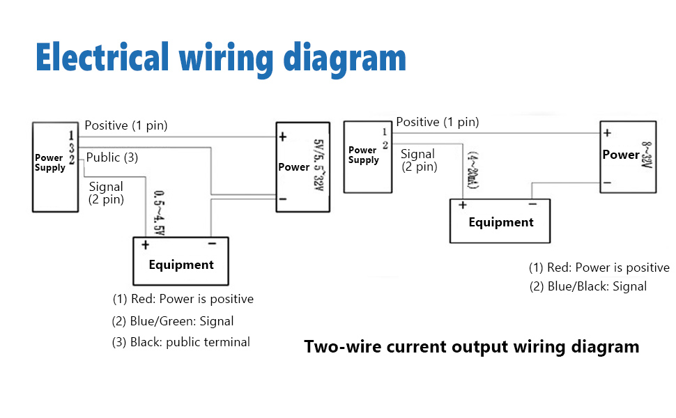
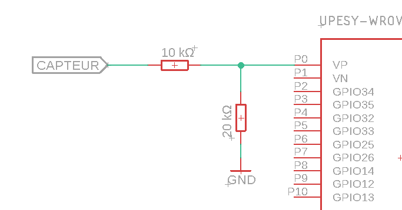
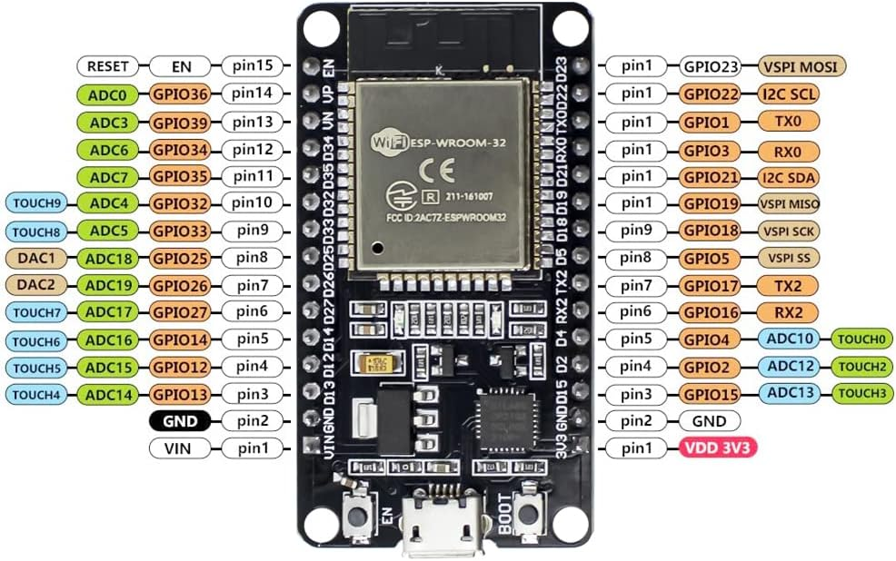
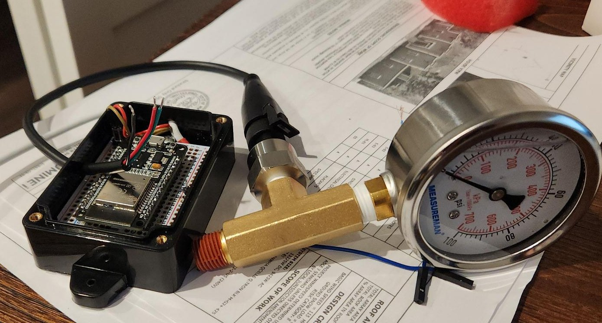
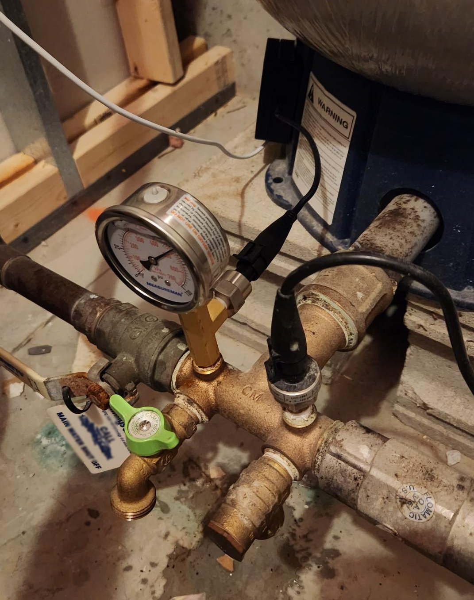

# Well water tank pressure monitor for Home Assistant

These are some notes for my well water tank pressure monitor setup

## Why

Well water tank pressure must be kept within specific range. Deviation from
that range indicates some issue with pump or controller. This setup helps monitor
pressure such that an action could be taken

## Raw schematics

TODO

## Hardware

* [Tee](https://www.amazon.com/dp/B004J0WYTM)
* [Gauge](https://www.amazon.com/dp/B07T744FLZ). Technically, the old one can be reused
* [Pressure Sensor](https://www.amazon.com/dp/B0CFJ7BN3L)
* [ESP32 Board](https://www.amazon.com/gp/product/B09XDMVS9N)
* [10kΩ resistors, need 3](https://www.amazon.com/dp/B0185FKB0K). We really need 10kΩ and 20kΩ, but if you don't have these already, it's cheaper to buy a pack and make a 20kΩ resistor out of two 10kΩ ones

### Sensor



We will use 3-wire installation method. Use [following for reference](https://www.upesy.com/blogs/tutorials/measure-voltage-on-esp32-with-adc-with-arduino-code?srsltid=AfmBOoqbeK0ZwHUacSQNsq6u9VUwDi_kszuw5pgsrrCHTiwGrIkdaFzH)

### ESP32



In lieu of 20kΩ resistor, two 10kΩ in series could be used.



This is specifically the board referenced above. ADC0 is mapped to pin14 (also marked VP). Other boards might have different pinout.

### Assembly

Assembled sensor + gauge



Installed:



## ESP32Home setup

use provided [yaml](wellmon.yaml) to deploy your monitor

### Calibrate

* Uncomment `- lambda: 'ESP_LOGD("adc", "Raw ADC Value: %f", x); return x`. Deploy to device
* Connect gauge to portable compressor
* Connect browser to local endpoint, such as http://wellmon.local and verify that values are correct
* Adjust values as necessary:

```yaml
      - calibrate_linear:
        - 0.34 -> 0
        - 0.61 -> 10
        - 0.90 -> 20
        - 1.14 -> 30
        - 1.43 -> 40
        - 1.69 -> 50
        - 1.95 -> 60
        - 2.22 -> 70
        - 2.42 -> 80
        - 2.67 -> 90
        - 2.90 -> 100

```

## Home Assistant

ESP32 add-on should discover device automatically
